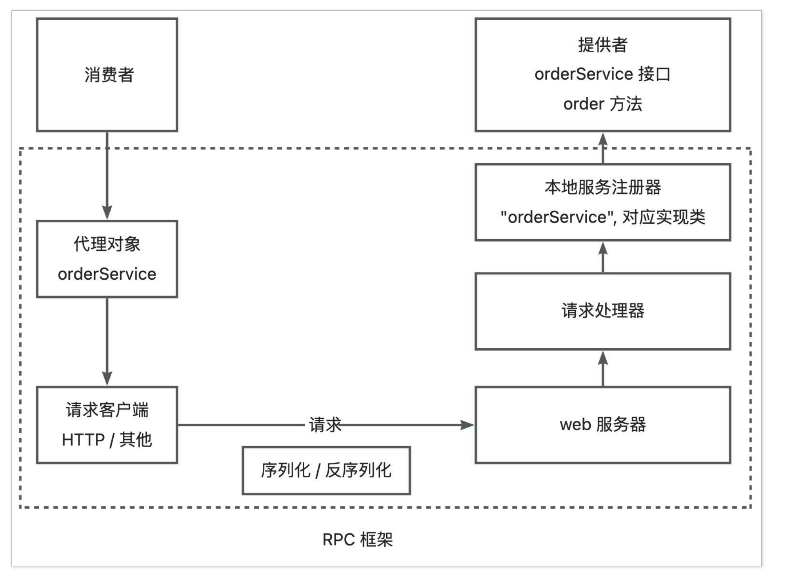
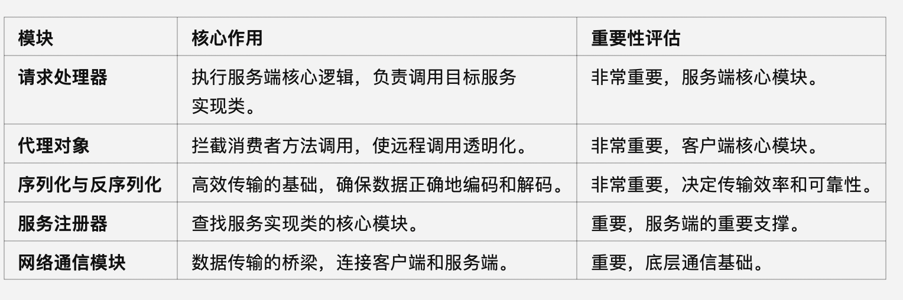

[TOC]

# 简易版本

## 架构图



## 各个组件的职能

**1. 代理对象：调用透明化的桥梁**

* **职责**：

  * 拦截消费者调用的本地方法。

  * 将本地方法调用转化为 RpcRequest 对象。

  * 发送请求并接收响应，最终返回结果给消费者。

* **重要性**：
  * 消费者调用的不是实际服务，而是通过代理对象完成。
  * 代理对象让消费者感知不到远程调用的存在，使远程调用像本地调用一样透明。

* **作用评估**：
  * 如果没有代理对象，消费者需要手动构造 RpcRequest、发送 HTTP 请求并解析响应，这对用户极其不友好。因此，代理对象是 RPC 框架的“入口点”，功不可没。

**2. 网络通信模块：数据传输的通道**

* **职责**：

  * 将序列化后的数据从客户端发送到服务端（如基于 HTTP）。

  * 将服务端的响应数据发送回客户端。

* **重要性**：

  * 网络通信是 RPC 框架的物理基础，直接决定了请求能否顺利传递。

  * 支持长连接、连接复用等优化机制，可以显著提升性能。

* **作用评估**：
  * 网络通信模块是数据传输的桥梁，虽然相对底层，但其重要性不可忽视。

**3. 序列化与反序列化：高效传输的基础**

* **职责**：

  * 将请求和响应对象序列化为字节流（客户端）。

  * 将字节流反序列化为对象（服务端）。

* **重要性**：

  * 数据传输的效率和准确性直接依赖序列化与反序列化。

  * 使用高效的序列化机制（如 Protobuf）可以显著提升性能。

* **作用评估**：
  * 序列化与反序列化是 RPC 框架的“底层基石”，是高效通信的核心。

**4. 请求处理器：核心逻辑的执行者**

* **职责**：

  * 从反序列化后的请求中提取服务名、方法名、参数类型和参数值。

  * 从服务注册器中查找目标服务实现类。

  * 使用反射调用目标服务方法，并捕获异常。

  * 封装方法执行结果或异常为响应。

* **重要性**：

  * 请求处理器负责实现服务端的“核心逻辑”：解析请求并调用业务方法。

  * 如果没有请求处理器，服务端无法正确执行请求。

* **作用评估**：
  * 请求处理器确实是服务端执行具体业务逻辑的关键模块。

**5. 服务注册器：服务查找的关键**

* **职责**：

  * 在服务端保存服务名与服务实现类之间的映射关系。

  * 请求处理器通过它找到目标服务的实现类。

* **重要性**：

  * 服务注册器是服务端管理服务的核心。

  * 如果没有它，服务端无法确定具体调用哪个实现类。

* **作用评估**：
  * 服务注册器是服务端的重要支撑模块。

---

**整体作用分工评估**



## 调用流程

1. **消费者发起 RPC 调用**：

*	消费者调用本地的服务接口（如 orderService）。

* RPC 框架为服务接口生成了代理对象（动态代理），拦截消费者的调用。

2. **代理对象处理调用**：

* 代理对象会将方法调用信息（方法名、参数、参数类型等）封装成一个 RpcRequest 对象。

* 通过序列化器将 RpcRequest 序列化为字节流，准备发送。

3. **请求客户端发送请求**：

* 请求客户端（如基于 HTTP 的客户端）将序列化后的字节流通过网络协议（如 HTTP）发送到远程服务端的 Web 服务器。

4. **服务端接收请求**：

* Web 服务器接收到 HTTP 请求，读取请求体，并通过反序列化器将字节流还原为 RpcRequest 对象。

5. **调用请求处理器**：

* Web 服务器将反序列化后的 RpcRequest 转发给请求处理器（HttpServerHandler 或类似组件）。

* 请求处理器从请求中提取服务名和方法名。

6. **请求处理器查找实现类**：

* 请求处理器通过本地服务注册器（如 LocalRegistry）根据服务名找到对应的服务实现类（提供者）。

7. **调用提供者方法**：

* 请求处理器使用反射机制，根据方法名、参数类型和参数值，调用服务实现类的具体方法，得到返回值。

8. **封装并返回响应**：

* 请求处理器将返回值封装成 RpcResponse 对象，并通过序列化器将其序列化为字节流。

* Web 服务器将序列化后的响应字节流通过 HTTP 返回给客户端。

9. **客户端接收响应**：

* 客户端接收到服务端返回的字节流，并通过反序列化器将其反序列化为 RpcResponse 对象。

* 代理对象返回调用结果给消费者，完成整个流程。


## RPC内部也使用了HTTP请求，为什么比直接使用HTTP要快？

 **1. 数据序列化效率更高**

* **传统 HTTP**：直接使用 HTTP 协议时，常用的 JSON 或 XML 格式用于数据传输，这些格式的解析和处理性能相对较低。

* **RPC 框架**：RPC 通常使用高效的二进制序列化方式（如 Protobuf、Thrift、Kryo）来代替 JSON 或 XML。

* 二进制序列化体积更小、性能更高。

* 序列化和反序列化的速度远超文本格式。

假设发送一个简单的用户信息请求：

**JSON格式：**

```json
{
  "userId": 12345,
  "name": "Alice"
}
```

字符串长度为 40 字节左右

**Protobuf 格式**：

```json
0x08 0x39 0x12 0x05 0x41 0x6C 0x69 0x63 0x65
```

二进制序列化后可能只有 9 字节。

---

**2. 减少了协议的额外开销**

* **传统 HTTP**：HTTP 是一个通用协议，包含大量冗余的报头信息（如 User-Agent、Accept 等），这些信息对于 RPC 调用来说是多余的。

  * 每次 HTTP 请求都会附带完整的 HTTP 请求头。

  * 响应也会返回完整的 HTTP 响应头。

* **RPC 框架**：
  * 可以精简协议头部，只保留必要的信息（如方法名、参数等）。

  * 通过自定义协议（如 gRPC 的 HTTP/2）优化了报文结构，减少了传输数据量。

**对比:**

* **传统 HTTP 请求头**：

```json
POST /api/v1/users HTTP/1.1
Host: example.com
Content-Type: application/json
User-Agent: curl/7.68.0
Content-Length: 40
```

请求头大小可能超过 200 字节。

* **RPC 自定义协议头**：

```json
serviceName: "UserService"
methodName: "getUser"
payload: <binary data>
```

头部信息可能仅需几十字节。

---

**3.支持长连接和连接复用**

* **传统 HTTP**：原生 HTTP 1.1 支持长连接，但通常应用中很多场景默认使用短连接，建立和关闭 TCP 连接会增加额外的开销。

* **RPC 框架**：
* 通常使用基于 HTTP/2 或 TCP 的长连接，支持连接复用。
  
* 长连接减少了每次请求建立和关闭连接的开销（如三次握手、四次挥手）。
  
* gRPC 使用 HTTP/2 多路复用特性，多个请求共用同一个连接，提升了并发性能。


# 全局配置

## 为什么ConfigUtil最后要return toBean

ConfigUtils 中的 return props.toBean(tClass, prefix); 或类似代码的 toBean 方法调用的目的是**将配置数据（通常是从文件加载的键值对）转化为 Java 对象**。这种方式可以让开发者更加方便地以面向对象的方式访问配置，而不是直接操作原始的键值对。


# Mock

Mock 是为要调用的服务创建一个 **模拟对象**，这个模拟对象的行为可以根据预先定义的逻辑来模拟真实服务的响应，避免依赖真实服务运行。

虽然 mock 服务并不是 RPC 框架的核⼼能⼒，但是它的开发成本并不⾼。⽽且**给 RPC 框架⽀持 mock 后，开发者就可以轻松调⽤服务接⼝、跑通业务流程**，不必依赖真实的远程服务，提⾼使⽤体验，何乐⽽不为呢？

**在客户端调用远程服务时，RPC 框架会拦截调用，并判断是否启用了 Mock。如果启用了 Mock，则返回一个预设的模拟结果，而不真正发送请求到服务端。**


# SPI

如果开发者不想使用我们框架内置的序列化器，想要自己定义一个新的序列化器实现，但不能修改我们写好的框架代码，应该怎么办呢？

只要我们的 RPC 框架能够读取到用户自定义的类路径，然后加载这个类，作为 Serializer 序列化器接口的实现即可。

SPI 机制允许服务提供者通过特定的配置文件将自己的实现注册到系统中，然后系统通过反射机制动态加载这些实现，而不需要修改原始框架的代码，从而实现了系统的解耦、提高了可扩展性。


1. 在META-INF下创建Serializer文件

2. 代码中添加各种序列化器

3. 自定义序列化器
   1. 指定SPI目录。**系统内置的 SPI 机制**会加载 `resources` 资源目录下的 `META-INF/services` 目录，那我们自定义的序列化器可以如法炮制，改为读取 `META-INF/rpc` 目录。
   2. 编写 SpiLoader 加载器。相当于一个工具类，提供了读取配置并加载实现类的方法。

关键实现如下：

1. 用 Map 来存储已加载的配置信息 `键名 => 实现类`。
2. 扫描指定路径，读取每个配置文件，获取到 `键名 => 实现类` 信息并存储在 Map 中。
3. 定义获取实例方法，根据用户传入的接口和键名，从 Map 中找到对应的实现类，然后通过反射获取到实现类对象。可以维护一个对象实例缓存，创建过一次的对象从缓存中读取即可。
